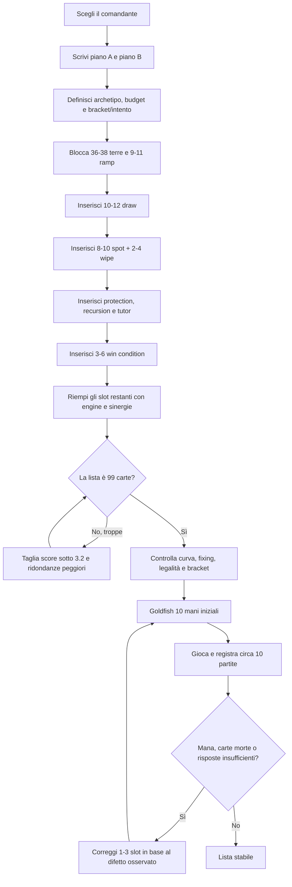

# Sistema opinionato per costruire mazzi Commander solidi

## Sintesi esecutiva

Questa guida propone un **sistema prescrittivo**, non una descrizione dell’unico modo “corretto” di costruire Commander. Il punto di partenza è un tavolo multiplayer da quattro giocatori, **metagame esatto non specificato**, budget non specificato e potenza casual-ottimizzata: grosso modo l’area oggi coperta da **Bracket 2–3**, con deviazioni esplicitamente indicate per combo e stax più spinti. Commander usa 99 carte più il comandante, singleton salvo terre base, e ogni carta deve rispettare l’identità di colore del comandante. citeturn16view0turn19view3

La mia regola-base è:

| Ruolo | Target iniziale |
|---|---:|
| Terre | **36** |
| Ramp | **10** |
| Card draw / vantaggio carte | **10** |
| Removal spot | **8** |
| Board wipe | **3** |
| Protezione | **3** |
| Recursion | **3** |
| Tutor | **2** |
| Win condition / finisher | **4** |
| Motore, sinergia, tema, minacce | **20** |
| **Totale, comandante escluso** | **99** |

È deliberatamente vicina alle euristiche moderne di EDHREC: una proposta pubblicata nel 2024 usa 35–38 terre, 10–12 ramp, 14 draw, 10 removal mirati, 2 wipe, 2 recursion e 2–4 protezioni; altri autori EDHREC discutono comunemente basi intorno a 35–38 terre. Questi dati non sono “regole ufficiali”, ma sono un utile controllo empirico sulle proporzioni. citeturn16view8

**Le regole centrali del sistema sono cinque.**

1. **Parti da 36 terre, non da 32–33.** Scendi solo perché curva, ramp economico e pescaggio lo giustificano; sali a 37–39 quando il comandante costa molto, il mazzo è control, colorless o particolarmente mana-hungry.
2. **Metti almeno 10 fonti di ramp e 10 di vantaggio carte** finché non hai una ragione concreta per fare diversamente.
3. **Gioca normalmente 8–10 spot removal + 2–4 wipe.** In control sali sensibilmente; in aggro/combo puoi scendere con i wipe, non necessariamente con l’interazione.
4. **Una carta multifunzione occupa un solo slot nel conteggio**, quello della sua funzione primaria. Il fatto che faccia due cose è un bonus di qualità, non un modo per falsare i numeri.
5. **Le ultime 20–25 carte fanno il mazzo; le prime 70–80 lo fanno funzionare.** Prima sistemi mana, pescaggio e interazione, poi massimizzi tema e “carte divertenti”.

Un controllo probabilistico spiega perché valori come 10–12 non siano arbitrari. In una libreria da 99 carte, ignorando mulligan e pescaggi extra, **10 copie funzionali di un ruolo danno circa il 67,4% di probabilità di vederne almeno una nelle prime 10 carte; 12 copie circa il 74,3%; 14 circa il 79,9%**. Con 36 terre, la probabilità di aprire sette carte con almeno due terre è circa **79,9%**; con 38 sale a circa **82,9%**. Sono calcoli ipergeometrici sul formato ufficiale da 99 carte più comandante. citeturn16view0

Una precisazione importante: con 36 terre restano **63 slot non-terra**, non “35 spell”. In Commander è più utile ragionare per **funzioni** che per “creature vs spell”: una creatura può essere contemporaneamente motore di pescaggio, removal, recursion o finisher.

Infine, la potenza non è indipendente dalle attuali convenzioni sociali del formato. Wizards distingue oggi cinque Commander Brackets: Exhibition, Core, Upgraded, Optimized e cEDH. Bracket 1–2 escludono i **Game Changers**, Bracket 3 ne permette fino a tre e Bracket 4–5 non impone quel limite; Wizards sottolinea inoltre che i bracket sono uno strumento opzionale per allineare le aspettative pre-partita. citeturn16view1turn19view4

## Vocabolario operativo e ruoli

### Removal e interaction

**Removal** è qualunque carta destinata principalmente a neutralizzare una risorsa avversaria già presente o in procinto di risolversi.

**Spot removal / single-target removal** indica un’interazione che risolve principalmente **una singola minaccia**: per esempio *Swords to Plowshares*, *Beast Within* o *Chaos Warp*. *Swords to Plowshares* costa un solo mana bianco ed esilia una creatura; *Beast Within* costa tre mana, distrugge qualsiasi permanente e lascia al suo controllore una 3/3. citeturn18search0turn18search6

**Mass removal / board wipe** colpisce più permanenti, spesso simmetricamente: *Blasphemous Act*, *Toxic Deluge*, *Supreme Verdict*, *Farewell*. Non va valutato come “spot removal più grande”: serve a **recuperare uno svantaggio di board o impedire che un singolo giocatore monopolizzi il tavolo**.

**Destroy** manda un permanente dal campo di battaglia al cimitero. **Exile** lo colloca invece in una zona normalmente non accessibile salvo testo specifico; per questo l’esilio è, in generale, una risposta più definitiva a recursion, death trigger e permanenti indistruttibili. Wizards specifica che un permanente con indestructible non può essere distrutto da danno o effetti “destroy”, mentre può essere eliminato con altri meccanismi. citeturn16view4turn16view5turn16view6

**Interaction** è il contenitore più ampio: spot removal, wipe, counterspell, hate per cimitero, stack interaction, tax effect e talvolta protezione reattiva. Un counter neutralizza una magia o abilità prima che risolva; dopo l’inizio della risoluzione è troppo tardi per neutralizzarla in quel modo. citeturn16view3

Per i miei conteggi, non sommare automaticamente tutte queste categorie. Se *Counterspell* è una delle tue otto risposte primarie, conta come **interaction/spot**, non anche come protezione.

### Ramp

Per **ramp** intendo una carta che ti permette di avere **più mana utilizzabile rispetto al normale sviluppo di una terra per turno**. Comprende:

- land ramp, come *Nature’s Lore*, *Farseek*, *Cultivate*;
- mana rock, come *Sol Ring*, *Arcane Signet*, Talismani e Signet;
- mana dork, come *Birds of Paradise*;
- rituali, se il mazzo può realmente convertire il mana temporaneo in un vantaggio decisivo.

Non conto come ramp un semplice fixing che non accelera il mana.

I dati EDHREC mostrano quanto queste categorie siano strutturali: nel campione “Top Cards – Past Month”, *Sol Ring* compare nell’84% dei mazzi eleggibili e *Arcane Signet* nel 71%; *Cultivate*, *Farseek*, *Nature’s Lore* e *Three Visits* restano fra le carte verdi più diffuse. La popolarità non prova che una carta sia automaticamente ottimale per ogni lista, ma dimostra la centralità del ruolo. citeturn16view9

### Card draw e card advantage

**Card draw** dovrebbe significare soprattutto **vantaggio di carte**, non soltanto filtraggio. Una carta che pesca una e si rimpiazza è un cantrip; migliora consistenza ma non risolve da sola il problema di rimanere senza risorse.

La mia prescrizione è contare come “draw” una carta solo quando:

- genera normalmente almeno **+1 carta netta**, oppure
- costituisce un motore ripetibile affidabile, oppure
- fa selection così profonda da essere fondamentale al piano combo/control.

Per questo in un combo blu *Ponder* e *Preordain* possono contribuire alla quota “draw/selection”, mentre in un midrange generico non li considererei equivalenti a un motore di vantaggio carte.

### Win condition

Una **win condition** non è semplicemente una carta potente. È una carta o piccolo pacchetto che, con condizioni realistiche, **converte il vantaggio acquisito in una vittoria**.

Esempi concettuali:

- alpha strike potenziato;
- drain massivo;
- combo finita;
- finisher inevitabile;
- lock che viene seguito da un modo concreto per chiudere;
- comandante stesso, se il mazzo è progettato per infliggere 21 danni da comandante, soglia prevista dalle regole ufficiali. citeturn19view3

Una lista senza una risposta chiara alla domanda “**come elimino tre avversari?**” tende a produrre valore senza terminare la partita.

### Tutor

Un **tutor** cerca una carta specifica o una classe molto ristretta di carte nella libreria.

Più tutor significa:

- maggiore consistenza;
- meno varianza;
- accesso più frequente alla carta migliore;
- combo più ripetitive;
- potenza percepita più elevata.

Il sistema attuale dei Game Changers riflette esplicitamente anche questo aspetto: Wizards cita tra i motivi della categoria la capacità di cercare con grande efficienza le carte più forti. citeturn19view4

Quindi la mia regola è **0–2 tutor generici nel casual**, **2–4 nel mid/high power**, **6+ solo quando stai intenzionalmente costruendo combo/optimized**. Alcuni tutor premium ricadono inoltre nelle restrizioni Game Changers del sistema attuale, per cui il conteggio va confrontato con il bracket desiderato. citeturn16view1turn19view4

### Recursion

**Recursion** recupera o riutilizza carte dal cimitero: *Reanimate*, *Eternal Witness*, *Sevinne’s Reclamation* e analoghi.

Il ruolo è diverso dal draw: pescare una carta casuale e recuperare esattamente il pezzo distrutto hanno valore strategico differente.

Target base: **3 slot**. Salgo a:

- 5–8 in nero graveyard/reanimator;
- 4–6 in verde permanent-based;
- 1–3 in mazzi che usano poco il cimitero.

### Protection

**Protection** impedisce che comandante, combo o board vengano neutralizzati: indestructible, hexproof, phase-out, counterspell difensivi, blink protettivo, regeneration ove applicabile.

Hexproof impedisce agli avversari di scegliere il permanente come bersaglio delle loro magie o abilità; indestructible protegge dalla distruzione ma non, per esempio, da exile o riduzione della costituzione. citeturn16view6

La regola è **3–5 protezioni** quando il mazzo dipende da comandante/engine; **5–8** se perdere un singolo pezzo ti fa saltare l’intero turno o la combo.

## Quote numeriche per struttura, archetipi e colori

### Template universale

La seguente è la mia griglia di partenza per un mazzo “normale” casual-ottimizzato:

| Categoria | Range raccomandato | Default |
|---|---:|---:|
| Terre | 35–38 | **36** |
| Ramp | 9–12 | **10** |
| Draw / advantage | 9–12 | **10** |
| Spot interaction | 8–10 | **8** |
| Board wipe | 2–4 | **3** |
| Protezione | 2–5 | **3** |
| Recursion | 2–4 | **3** |
| Tutor | 0–3 | **2** |
| Wincon / finisher | 3–6 | **4** |
| Engine / sinergia / minacce | 16–24 | **20** |

Queste quantità sono intenzionalmente meno permissive del classico “metto tutte le carte a tema che mi piacciono e poi vedo cosa resta”. L’esperienza pubblicata su EDHREC converge su una struttura simile: 35–38 terre, 10–12 ramp e quantità a doppia cifra per draw/removal sono una base comune nelle moderne euristiche di costruzione. citeturn16view8

**Regola di ridondanza:** per qualsiasi azione che il mazzo *deve* compiere ogni partita, mira ad almeno **8 copie funzionali**, preferibilmente **10–12**. Una guida italiana di Metagame identifica anch’essa la ridondanza — carte diverse con effetti equivalenti, citando proprio *Beast Within* e *Generous Gift* — come principio importante nel deckbuilding Commander. citeturn16view10

### Range per archetipo

| Archetipo | Terre | Ramp | Draw | Spot interaction | Wipe | Protection / counter | Recursion | Tutor | Wincon / combo | Slot tema/engine |
|---|---:|---:|---:|---:|---:|---:|---:|---:|---:|---:|
| **Aggro** | 34–36 | 9–11 | 8–10 | 6–8 | 1–3 | 4–6 | 1–3 | 0–2 | 5–7 | 20–24 |
| **Control** | 36–38 | 8–10 | 11–14 | 10–13 | 4–6 | 7–10 | 2–4 | 2–4 | 2–4 | 7–11 |
| **Combo** | 33–36 | 11–14 | 12–15 | 5–8 | 1–3 | 8–11 | 2–4 | 3–10* | 4–7 | 4–10 |
| **Midrange** | 35–37 | 9–11 | 10–12 | 8–10 | 2–4 | 3–5 | 3–5 | 2–4 | 4–6 | 12–16 |
| **Group Hug** | 36–38 | 8–10 | 9–11** | 5–7 | 1–3 | 3–5 | 1–3 | 0–2 | 3–5 | 22–26 |
| **Stax** | 35–37 | 9–11 | 9–11 | 8–10 | 2–4 | 4–6 | 2–4 | 3–5 | 3–5 | 13–18 |

\* **Combo:** 3–5 tutor se vuoi mantenere una forte componente casual; 6–10 implica deliberatamente un’esperienza molto più ottimizzata. I Bracket attuali distinguono esplicitamente gameplay socialmente orientato (1–3) da Optimized/cEDH (4–5). citeturn16view1

\** In Group Hug, per “draw” intendo **pescaggio che garantisce risorse a te**. *Howling Mine* non deve diventare una scusa per avere zero vantaggio personale: aiutare tre avversari può aumentare più le risorse aggregate del tavolo che le tue.

### Target per identità di colore

Questi numeri **non sono regole del color pie**; sono target del sistema che compensano punti di forza e debolezze tipici delle identità. Il color pie ufficiale di Wizards è la base concettuale: verde è il colore tradizionalmente più forte nell’accelerazione permanente/terre; bianco ha molta rimozione condizionale e board clearing; blu eccelle nell’interazione sulla pila e nella selezione; nero è particolarmente legato al cimitero; la distribuzione delle meccaniche resta comunque evolutiva e l’articolo ufficiale stesso è una fotografia del 2021. citeturn16view7

| Identità | Terre | Ramp | Draw | Spot | Wipe | Protection / counter | Recursion | Tutor | Correzione principale |
|---|---:|---:|---:|---:|---:|---:|---:|---:|---|
| **Bianco** | 36–38 | 8–10 | 8–10 | **10–13** | **3–5** | 4–6 | 2–4 | 1–3 | sfrutta removal/protection eccellenti |
| **Blu** | 35–37 | 8–10 | **11–14** | 5–7 | 2–4 | **5–8 counter + 3–5 protection** | 1–3 | 2–4 | meno destroy, più stack/bounce |
| **Nero** | 35–37 | 8–11 | 10–13 | **9–12** | 3–5 | 2–4 | **5–8** | 3–6 | usa vita e cimitero come risorse |
| **Rosso** | 35–37 | 9–12 | 9–12 | 7–10 | 2–4 | 3–5 | 2–4 | 1–3 | privilegia impulse draw e flessibilità |
| **Verde** | 35–37 | **11–14** | 9–12 | 7–9 | 1–3 | 4–6 | **4–6** | 3–5 | riduci rock mediocri, aumenta land ramp |
| **Colorless** | **37–39** | **12–15** | 8–11 | 7–10 | 2–4 | 3–5 | 3–5 | 2–5 | compensare costi e limiti di risposta |
| **2+ colori** | 36–38 | 9–11 | 10–12 | 8–10 | 2–4 | 3–5 | 3–5 | 2–4 | scegli il meglio dei colori disponibili |

Per multicolor la regola più utile è: **non fare la media delle debolezze dei colori; usa ciascun colore per coprire quelle degli altri**. Un Golgari non dovrebbe giocare creature-only removal nero mediocre quando può usare removal BG/verde che colpisce quasi qualsiasi permanente.

Per le terre, il mio correttivo è semplice:

- mono/bi-color: **36–37**;
- tre colori: **37** come default;
- quattro/cinque colori: **37–38**;
- sottrai una terra soltanto se curva e accelerazione economica lo giustificano davvero.

## Regole prescrittive per removal e targeting

### Quanta interazione giocare

Per una lista generica:

**8–10 spot removal + 2–4 mass removal**.

All’interno degli 8–10 spot voglio, idealmente:

| Specifica | Target |
|---|---:|
| Costo ≤2 mana | **almeno 4**, idealmente 5–6 |
| Instant speed | **almeno metà** |
| Risposte a creature | **4–6** |
| Risposte ad artifact/enchantment | **almeno 2–3** |
| Risposte che colpiscono più tipi di permanente | **almeno 3–4** |
| Exile / bounce / sacrifice / -X/-X o altre risposte non-destroy | **almeno 2** |
| Graveyard hate dedicato | **1–2**, separato o integrato |
| Counterspell, se blu | **3–6** nel midrange; **6–10** in control/combo |

L’attuale popolarità EDHREC è coerente con l’idea che removal economico e ampio sia un bene strutturale: *Swords to Plowshares* è attorno al 61% nelle liste bianche eleggibili, *Path to Exile* 49%, *Assassin’s Trophy* 35%, *Beast Within* 31%, *Chaos Warp* 28%, *Anguished Unmaking* 27% nel campione mensile consultato. citeturn16view9

Questi numeri sono **popolarità, non graduatorie di forza**.

### Single-target contro mass removal

**Preferisci spot removal quando:**

- c’è **una sola carta** che sta realmente creando il problema;
- sei avanti di board e una wipe ti danneggerebbe più degli avversari;
- devi impedire una combo o un engine prima che produca valore;
- puoi spendere 1–2 mana e continuare il tuo turno;
- eliminare esattamente quel pezzo fa collassare il piano avversario.

**Preferisci mass removal quando:**

- sei dietro di almeno **due minacce rilevanti** rispetto al giocatore dominante;
- due o più avversari hanno board che richiederebbero molte carte singole;
- il valore rimosso supera nettamente quello che perdi;
- una singola risposta non basta a impedire la vittoria;
- devi resettare creature/token/stax pieces prima di poter ricostruire.

La mia soglia pratica è:

> **Wipe se elimina almeno cinque permanenti avversari realmente rilevanti perdendone al massimo due tuoi, oppure se è necessaria per impedire una vittoria nel giro successivo.**

Non aspettare arbitrariamente “più valore” se il tavolo è già letale. Viceversa, non lanciare *Wrath of God* su tre creature mediocri perché “prima o poi andava usata”.

Il motivo è particolarmente importante in Commander: un one-for-one neutralizza una carta di **uno** dei tre avversari, mentre gli altri due non hanno speso risorse. Perciò lo spot removal va riservato a permanenti con impatto sproporzionato, non a ogni carta semplicemente forte. Commander è ufficialmente un ambiente free-for-all multiplayer, tipicamente a quattro giocatori. citeturn19view3

### Exile contro destroy

**Preferisci exile** contro:

- indestructible;
- death trigger pericolosi;
- reanimator;
- recursion ripetibile;
- combo che usa il cimitero;
- creature che l’avversario è chiaramente felice di sacrificare o rianimare.

**Preferisci destroy** quando è sostanzialmente più efficiente e il cimitero non è una risorsa rilevante.

Wizards definisce destroy come spostamento nel cimitero ed exile come collocazione separata dal normale flusso del gioco; indestructible impedisce specificamente gli effetti “destroy”, non tutte le forme di rimozione. citeturn16view4turn16view5turn16view6

Quindi non pagare automaticamente tre mana per exile se un removal da uno risolve esattamente lo stesso problema; ma **conserva almeno 1–2 risposte definitive** nel mazzo.

### Targeted contro non-targeted

**Targeted** è preferibile per precisione ed efficienza.

**Non-targeted** diventa preferibile quando il tavolo presenta:

- hexproof;
- protezioni dal colore;
- effetti che puniscono il targeting;
- creature singole difficili da bersagliare;
- board largo, dove una risposta individuale è inefficiente.

Hexproof impedisce precisamente che un permanente o giocatore venga bersagliato da magie/abilità controllate dagli avversari; in questi casi sacrifice, wipe o effetti globali aggirano il problema perché non devono scegliere quel permanente come bersaglio. citeturn16view6

Una buona suite non deve essere omogenea: **6–8 targeted + 2–4 non-targeted/mass** è molto più robusto di dieci varianti dello stesso “destroy target creature”.

### Conditional contro unconditional

**Conditional removal**: *Destroy target tapped creature*, “creature con forza ≥4”, “nonblack creature”, solo artifact, solo enchantment, ecc.

La mia regola:

> Gioca removal condizionale soltanto se **colpisce almeno l’80% delle minacce che prevedi davvero**, oppure costa almeno un mana meno dell’alternativa incondizionata, oppure la condizione crea una sinergia diretta con il comandante.

Altrimenti, scegli **unconditional/broad removal**.

Commander produce board estremamente eterogenei; una carta morta in mano ha un costo enorme quando devi rispondere a tre avversari.

### Una gerarchia pratica di qualità

Per uno spot removal, valuta in quest’ordine:

**efficienza di mana → ampiezza dei bersagli → velocità instant → qualità della rimozione → drawback → sinergia.**

Esempi rappresentativi:

| Carta | Costo / velocità | Copertura | Tipo di risposta | Valutazione nel sistema |
|---|---|---|---|---|
| **Swords to Plowshares** | W, instant | creatura | exile | riferimento per efficienza; drawback normalmente accettabile. citeturn18search0 |
| **Path to Exile** | W, instant | creatura | exile | eccellente, ma il land dato all’avversario conta molto nei primi turni. citeturn16view9 |
| **Beast Within** | 2G, instant | qualsiasi permanente | destroy + 3/3 | più lento, ma copertura straordinaria. citeturn18search6 |
| **Generous Gift** | 2W, instant | qualsiasi permanente | destroy + 3/3 | equivalente funzionale molto utile per ridondanza; è comune anche nelle guide italiane di deckbuilding. citeturn16view10turn16view9 |
| **Assassin’s Trophy** | BG, instant | permanente avversario | destroy + basic | molto efficiente e ampio; drawback reale ma spesso accettabile. citeturn16view9 |
| **Anguished Unmaking** | 1WB, instant | nonland permanent | exile, perdi vita | risposta definitiva molto ampia. citeturn16view9 |
| **Chaos Warp** | 2R, instant | permanente | shuffle/replacement | prezioso in rosso perché copre tipi difficili; molto diffuso su EDHREC. citeturn16view9 |
| **Feed the Swarm** | 1B, sorcery | creatura/enchantment avversario | destroy, perdita di vita | particolarmente importante perché amplia le risposte nere agli enchantment; compare stabilmente nei top EDHREC. citeturn16view9 |
| **Toxic Deluge** | 2B, sorcery | creature globalmente | -X/-X | wipe flessibile che evita il problema di indestructible perché non “distrugge”. citeturn16view6turn16view9 |
| **Blasphemous Act** | costo variabile, sorcery | creature globalmente | danno | wipe rosso molto efficiente nei board affollati; ~35% nel campione EDHREC. citeturn16view9 |

**Regola di taglio:** una rimozione a sorcery speed da tre o più mana che colpisce **solo creature** deve avere una ragione specifica per restare. Senza sinergia, è uno dei primi upgrade da fare.

## Template pratici per archetipi

Per i conteggi seguenti, **ogni carta occupa una sola categoria primaria** anche se svolge più funzioni. I suggerimenti sono esempi di nuclei di carte, non mini-decklist universali; vanno rispettate identità di colore, banned list e bracket. Wizards collega direttamente la pagina Commander sia alla lista Banned and Restricted sia a Gatherer, il database ufficiale delle carte. citeturn19view3turn17view2

### Aggro

**Obiettivo:** sviluppare board rapidamente, proteggere il vantaggio e convertire creature/token in danni prima che control e value deck stabilizzino.

| Slot | Quantità |
|---|---:|
| Terre | 35 |
| Ramp | 10 |
| Draw | 9 |
| Spot removal | 7 |
| Wipe | 2 |
| Protection | 5 |
| Recursion | 2 |
| Tutor | 1 |
| Wincon / pump / finisher | 6 |
| Creature, token engine, synergy | 22 |
| **Totale** | **99** |

**Regole:** massimo 1–3 wipe; preferisci wipe asimmetriche o carte che salvano il tuo board. La protezione vale più del quinto board wipe. La curva deve essere aggressivamente bassa.

**Pacchetto esemplificativo Naya, 13 carte:** *Sol Ring*; *Birds of Paradise*; *Nature’s Lore*; *Three Visits*; *Skullclamp*; *Swords to Plowshares*; *Path to Exile*; *Beast Within*; *Heroic Intervention*; *Boros Charm*; *Akroma’s Will*; *Beastmaster Ascension*; *Craterhoof Behemoth*. Molte di queste carte compaiono tra gli staple più utilizzati nei dati EDHREC correnti, inclusi *Sol Ring*, *Swords*, *Path*, *Nature’s Lore*, *Three Visits*, *Beast Within*, *Heroic Intervention* e *Boros Charm*. citeturn16view9

**Principio:** non riempire lo slot “aggro” di sole creature. Un board con 12 creature e zero protezione perde da una singola wipe; 9 creature + una protezione ben tenuta possono essere molto più pericolose.

### Control

**Obiettivo:** sopravvivere, scambiare risorse in modo selettivo, produrre vantaggio carte e chiudere soltanto quando il tavolo non può più recuperare.

| Slot | Quantità |
|---|---:|
| Terre | 37 |
| Ramp | 9 |
| Draw | 12 |
| Spot removal | 12 |
| Wipe | 5 |
| Counter/protection | 8 |
| Recursion | 2 |
| Tutor | 3 |
| Wincon | 3 |
| Engine / utility | 8 |
| **Totale** | **99** |

**Regola:** control deve avere **più pescaggio che removal**. Se giochi 20 risposte e 7 fonti di vantaggio carte, finirai spesso le risposte prima che tre avversari finiscano le minacce.

**Pacchetto esemplificativo Esper, 13 carte:** *Swords to Plowshares*; *Anguished Unmaking*; *Void Rend*; *Counterspell*; *Arcane Denial*; *Swan Song*; *Dovin’s Veto*; *Toxic Deluge*; *Supreme Verdict*; *Mystic Remora*; *Fact or Fiction*; *Vindicate*; *Approach of the Second Sun*. *Counterspell*, *Arcane Denial*, *Swan Song*, *Dovin’s Veto*, *Toxic Deluge*, *Mystic Remora*, *Void Rend* e diversi removal del pacchetto hanno ancora ampia presenza nei dati aggregati EDHREC. citeturn16view9

**Target di interazione:** almeno **5 risposte da 0–2 mana**. Il control che può iniziare a interagire solo a tre mana è troppo lento contro combo e commander engine efficienti.

### Combo

**Obiettivo:** assemblare un insieme ristretto di carte che vince, proteggendo l’azione decisiva e riducendo al minimo le carte morte.

| Slot | Quantità |
|---|---:|
| Terre | 34 |
| Ramp | 13 |
| Draw / selection | 13 |
| Spot interaction | 7 |
| Wipe | 2 |
| Counter / protection | 9 |
| Recursion | 3 |
| Tutor | 8 |
| Combo / win pieces | 6 |
| Engine / utility | 4 |
| **Totale** | **99** |

Questo è intenzionalmente un template **Optimized**, non il mio casual default. Otto tutor più combo compatte portano il mazzo molto più vicino alla filosofia Bracket 4 che a una normale lista Core/Upgraded; i Bracket ufficiali distinguono esplicitamente questi livelli e limitano i Game Changers nei bracket inferiori. citeturn16view1turn19view4

Per una versione casual, usa **35–36 terre, 3–5 tutor, 6–10 carte tematiche aggiuntive** e combo meno compatte.

**Pacchetto esemplificativo Grixis high-power, 15 carte:** *Sol Ring*; *Arcane Signet*; *Talisman of Dominance*; *Ponder*; *Preordain*; *Brainstorm*; *Demonic Tutor*; *Mystical Tutor*; *Underworld Breach*; *Brain Freeze*; *Thassa’s Oracle*; *Demonic Consultation*; *Tainted Pact*; *Swan Song*; *Force of Will*.

Questo pacchetto è volutamente ad alta potenza e comprende carte che possono ricadere nell’attuale lista Game Changers; va quindi dichiarato chiaramente nel Rule 0/pregame discussion e confrontato con il bracket desiderato. Wizards considera proprio tutoring efficiente e gameplay fortemente polarizzante tra i criteri che segnalano un’esperienza diversa dal casual più leggero. citeturn19view4

### Midrange

**Obiettivo:** giocare carte intrinsecamente buone che producano valore, interagire quando necessario e trasformare gradualmente il vantaggio in una posizione dominante.

| Slot | Quantità |
|---|---:|
| Terre | 36 |
| Ramp | 10 |
| Draw | 11 |
| Spot removal | 9 |
| Wipe | 3 |
| Protection | 4 |
| Recursion | 4 |
| Tutor | 3 |
| Wincon | 5 |
| Engine / minacce | 14 |
| **Totale** | **99** |

Questo è il template che userei più spesso come **punto zero**.

**Pacchetto esemplificativo Abzan, 14 carte:** *Nature’s Lore*; *Farseek*; *Cultivate*; *Swords to Plowshares*; *Beast Within*; *Assassin’s Trophy*; *Anguished Unmaking*; *Toxic Deluge*; *Eternal Witness*; *Reanimate*; *Guardian Project*; *Skullclamp*; *Heroic Intervention*; *Finale of Devastation*. Ramp verde e spot removal efficienti di questi colori sono fortemente rappresentati nelle statistiche aggregate correnti di EDHREC. citeturn16view9

**Regola:** almeno metà delle minacce midrange deve essere utile **anche senza comandante**. Se il comandante viene rimosso due volte e 20 carte diventano mediocri, hai costruito un deck “commander-dependent”, non un midrange robusto.

### Group Hug

**Obiettivo:** manipolare l’economia del tavolo con risorse, incentivi e politica senza rinunciare alla capacità di vincere.

| Slot | Quantità |
|---|---:|
| Terre | 37 |
| Ramp personale | 9 |
| Draw personale / selezione | 10 |
| Spot removal | 6 |
| Wipe | 2 |
| Protection | 4 |
| Recursion | 2 |
| Tutor | 1 |
| Wincon | 4 |
| Hug / politica / engine | 24 |
| **Totale** | **99** |

**Pacchetto esemplificativo WURG, 14 carte:** *Howling Mine*; *Font of Mythos*; *Rites of Flourishing*; *Heartbeat of Spring*; *Dictate of Karametra*; *Collective Voyage*; *Tempt with Discovery*; *Secret Rendezvous*; *Minds Aglow*; *Kwain, Itinerant Meddler*; *Swords to Plowshares*; *Beast Within*; *Disrupt Decorum*; *Approach of the Second Sun*.

**Regola più importante:** non contare automaticamente un effetto simmetrico come ramp o draw personale. Se *Rites of Flourishing* accelera quattro persone, appartiene principalmente allo slot **hug/politics**, non sostituisce automaticamente uno dei tuoi dieci modi affidabili di far funzionare il mazzo.

E soprattutto: **4 win condition vere**. Un Group Hug senza modo di vincere non è necessariamente “più casual”; spesso rende semplicemente arbitrarie le risorse che decidono quale avversario vince.

### Stax

**Obiettivo:** restringere azioni, mana o sequenze di gioco degli avversari più di quanto restringa le proprie, quindi vincere sotto quella asimmetria.

| Slot | Quantità |
|---|---:|
| Terre | 36 |
| Ramp | 10 |
| Draw | 10 |
| Spot removal | 9 |
| Wipe | 3 |
| Protection | 5 |
| Recursion | 3 |
| Tutor | 4 |
| Wincon | 4 |
| Tax / lock / stax pieces | 15 |
| **Totale** | **99** |

**Pacchetto esemplificativo Orzhov, 14 carte:** *Rule of Law*; *Archon of Emeria*; *Aven Mindcensor*; *Blind Obedience*; *Damping Sphere*; *Rest in Peace*; *Aura of Silence*; *Winter Orb*; *Smokestack*; *Swords to Plowshares*; *Anguished Unmaking*; *Toxic Deluge*; *Reanimate*; *Luminarch Ascension*.

Qui il **Rule 0 conta più del semplice numero di carte potenti**: Wizards definisce l’intento e la filosofia del bracket come il fattore più importante e include esplicitamente mass land denial e altri pattern di gioco tra i barometri con cui distinguere le esperienze Commander. citeturn16view1

**Regola:** ogni lock piece deve superare una domanda: “**Io rompo la simmetria?**” Se *Winter Orb* rallenta te esattamente quanto gli avversari, non stai costruendo stax efficiente; stai soltanto allungando la partita.

## Valutazione delle carte e tuning

### Un punteggio pratico

Per ogni nonland che non sia un pezzo combo insostituibile, assegno un voto 0–5 su quattro dimensioni principali più una secondaria:

| Metrica | Peso | Domanda |
|---|---:|---|
| **Sinergia** | **30%** | quanto direttamente avanza comandante, engine o piano di vittoria? |
| **Efficienza di mana** | **25%** | quanto impatto ottengo per il mana e a quale punto della curva? |
| **Versatilità** | **20%** | quante situazioni/target/modalità copre senza diventare morta? |
| **Potenza intrinseca** | **20%** | quanto è buona quando non ho già il setup perfetto? |
| **Resilienza / ridondanza** | **5%** | è facilmente neutralizzata? è sostituibile da equivalenti? |

Formula:

\[
\text{Score}=0{,}30S+0{,}25E+0{,}20V+0{,}20P+0{,}05R
\]

Interpretazione:

| Score | Azione |
|---:|---|
| **4,2–5,0** | quasi automatico se coerente con il power level |
| **3,7–4,19** | slot forte |
| **3,2–3,69** | deve avere una funzione precisa |
| **<3,2** | prima candidata al taglio |
| **eccezione** | combo piece, pet card o requisito tematico dichiarato |

Questo metodo impedisce un errore comune: scambiare **sinergia massima** per qualità complessiva. Una carta che fa qualcosa di incredibile solo quando comandante + due permanenti specifici sono già in campo ha ceiling alto ma floor bassissimo.

Per interaction modifico leggermente la priorità: **efficienza e versatilità prevalgono sulla sinergia**. *Swords to Plowshares* non deve “sinergizzare col comandante” per essere un’eccellente risposta: il suo valore nasce da costo, velocità e qualità della rimozione. Il suo tasso d’inclusione EDHREC estremamente alto è coerente con questo profilo. citeturn18search0turn16view9

### Guardrail della curva

Come regola del sistema:

- mazzo casual/midrange: **mana value medio dei nonland circa 2,8–3,5**;
- optimized/combo: **2,2–3,0**;
- evita più di **8–10 carte da MV 5+** salvo big-mana, battlecruiser o commander che lo giustifichi;
- il ramp da tre mana deve competere con la possibilità di avere già giocato ramp a due.

Non considero questi valori “leggi statistiche universali”; sono soglie di progetto. La domanda importante è: **quante mani iniziali fanno una giocata rilevante prima del turno tre?**

### Regole di tuning dopo le partite

Non cambiare dieci carte dopo una singola partita. Registra almeno **10 partite** e annota:

| Segnale | Correzione |
|---|---|
| ≤2 terre / sviluppo bloccato in ≥3 partite | **+1 terra**, poi rivaluta ramp |
| Mana abbondante ma mano vuota | **+2 draw**, -2 carte situazionali |
| Sempre carte in mano ma non abbastanza mana | **+1–2 ramp/terre** |
| Perdi con removal morto in mano | aumenta **versatilità**, non necessariamente quantità |
| Perdi perché non peschi risposte | **+2 interaction** |
| Risposte sempre in mano e nessuna pressione | -1/-2 interaction, +wincon/engine |
| Comandante viene rimosso e il mazzo smette di funzionare | +protection **e** più motori indipendenti |
| Produci enorme valore ma non chiudi | +2 wincon / finisher |
| Tutor cerca sempre la stessa carta | chiediti se stai giocando una combo implicita e dichiara il power level |
| Una carta è morta ≥4 volte su 10 | taglio prioritario salvo combo piece |

Il playtesting è fondamentale anche nelle moderne guide EDHREC, che esplicitamente discutono l’aggiustamento delle terre dopo prove reali piuttosto che trattare un singolo numero come universale. citeturn16view8

Un’altra regola forte: **quando devi tagliare, non partire dalle terre**. Taglia prima:

carta “carina” a 6 mana → removal troppo condizionale → duplicato peggiore → payoff senza abbastanza enabler → tutor superfluo → solo infine mana source, se i dati lo giustificano.

## Algoritmo di costruzione e fonti operative

Il processo completo può essere ridotto a questa pipeline:

In forma prescrittiva:

**Comandante → piano di vittoria → archetipo → potenza desiderata → mana → draw → interaction → resilienza → wincon → tema → tagli → test.**

Non fare il contrario. Partire da 70 carte “in tema” e cercare di comprimere tutte le infrastrutture nei 29 slot rimasti produce la maggior parte dei mazzi Commander inconsistenti.

### Gerarchia delle fonti

Per costruire e verificare una lista, userei le fonti in quest’ordine:

**Gatherer/Wizards per legalità, Oracle text, regole e policy.** Wizards identifica Gatherer come il proprio “Card Database” ufficiale e la pagina Commander corrente contiene le regole del formato, i bracket e il collegamento alla banned list. citeturn17view2turn19view3

**Scryfall per ricerca tecnica e filtraggio.** È particolarmente utile per query del tipo “instant, ≤2 mana, exile creature” o per trovare equivalenti funzionali; supporta anche stampe/localizzazioni italiane, come mostra per esempio la scheda italiana di *Beast Within / Bestia Interiore*. citeturn18search9

**EDHREC per frequenze e scoperta di sinergie**, non come autorità assoluta. Il suo valore è dirti cosa viene effettivamente giocato: nel campione mensile consultato *Sol Ring* è all’84%, *Arcane Signet* 71%, *Swords to Plowshares* 61%, *Path to Exile* 49%, *Counterspell* 41%, *Assassin’s Trophy* e *Blasphemous Act* circa 35%, *Beast Within* 31%. Questi numeri sono un eccellente segnale di consenso, ma una carta popolare non è automaticamente corretta per il tuo comandante, bracket o meta. citeturn16view9

**Risorse italiane per contesto e discussione.** Metagame ospita materiale in italiano specificamente dedicato al deckbuilding Commander e una sezione Commander dedicata a deckbuilding, mazzi, combo e regole; la sua guida indicizzata sottolinea esplicitamente ridondanza, interazione col cimitero e tutor. citeturn16view10turn17view3

### La checklist finale

Un mazzo, secondo questo sistema, è pronto quando puoi rispondere **sì** a tutte queste domande:

| Controllo | Specifica |
|---|---|
| Mana | **35–38 terre**, salvo motivazione quantitativa per uscire dal range |
| Accelerazione | **9–12 ramp**; 11–14 in verde/big mana |
| Risorse | **10–12 fonti reali** di draw/advantage |
| Spot interaction | **8–10**, di cui almeno metà economica e almeno metà instant quando i colori lo consentono |
| Mass interaction | **2–4 wipe**; 4–6 in control |
| Copertura | rispondi a **creature + artifact + enchantment + graveyard + stack/combo** in modo coerente con i colori |
| Removal definitivo | **almeno 2** risposte exile/non-destroy quando disponibili |
| Protezione | **3–5** se comandante/engine è importante |
| Recursion | **2–4**, più alta se il cimitero è una risorsa |
| Tutor | **0–2 casual**, 2–4 high-power, oltre solo intenzionalmente |
| Wincon | **3–6 modi concreti di chiudere** |
| Ridondanza | **8–12 copie funzionali** delle azioni indispensabili |
| Curva | la maggior parte del mazzo agisce prima di MV 4 |
| Carte morte | removal condizionale ammesso solo con hit rate atteso ≈**80%+** o forte sinergia |
| Board wipe | lanciarla quando recupera netto valore o evita una vittoria, non “perché ce l’hai” |
| Bracket | power level, Game Changers, combo e stax sono coerenti con la conversazione pre-partita; Wizards considera oggi l’**intento** del bracket più importante del mero conteggio di carte. citeturn16view1turn19view4 |

Il principio conclusivo è quindi volutamente rigido: **36 terre, 10 ramp, 10 draw, 8 spot removal e 3 wipe prima di guadagnarti il diritto di essere creativo con il resto**. Da lì si devia soltanto perché il comandante, l’archetipo, il color pie o i risultati del testing forniscono una ragione precisa. È un sistema più conservativo delle liste “greedy”, ma in un formato singleton da 99 carte e tre avversari privilegia ciò che rende un mazzo realmente giocabile: consistenza, capacità di vedere le proprie funzioni fondamentali e risposte sufficientemente flessibili. Le regole ufficiali rendono Commander intenzionalmente ampio e multiplayer; il sistema dei bracket esiste proprio perché “ben costruito” non significa automaticamente “più potente possibile”. citeturn16view0turn16view1